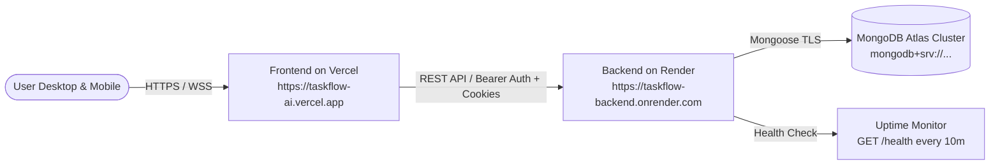

# TaskFlow AI — Production Deployment Guide

This guide provides step-by-step instructions for deploying TaskFlow AI to production:
- **Database:** MongoDB Atlas (M0 Free Tier or Dedicated)
- **Backend API:** Render (Free / Starter Web Service)
- **Frontend SPA:** Vercel (Hobby / Pro)
- **Source Control:** GitHub

---

## 🏛️ Deployment Architecture



---

## Step 1: Set Up MongoDB Atlas

1. **Sign Up / Log In**: Go to [MongoDB Atlas](https://www.mongodb.com/cloud/atlas) and log in.
2. **Create a Free Cluster**:
   - Choose **M0 Sandbox** (Free Tier).
   - Select your preferred cloud provider (AWS/GCP/Azure) and a region close to your users (e.g. `us-east-1` or `eu-central-1`).
   - Click **Create Deployment**.
3. **Configure Database Access (User)**:
   - Go to **Security** → **Database Access** → **Add New Database User**.
   - Authentication Method: **Password**.
   - Username: e.g. `taskflow_user`.
   - Password: Click **Autogenerate Secure Password** and copy it safely.
   - Database User Privileges: **Read and write to any database**.
4. **Configure Network Access (IP Whitelist)**:
   - Go to **Security** → **Network Access** → **Add IP Address**.
   - Click **Allow Access from Anywhere** (`0.0.0.0/0`). *(Render uses dynamic outbound IP addresses, so `0.0.0.0/0` is required).*
   - Confirm and save.
5. **Obtain Connection String**:
   - Go to **Deployments** → **Database** → Click **Connect**.
   - Select **Drivers** (Node.js).
   - Copy the SRV connection string:
     ```text
     mongodb+srv://taskflow_user:<password>@cluster0.xxxxx.mongodb.net/taskflow?retryWrites=true&w=majority
     ```
   - Replace `<password>` with the generated password and replace database name before `?` with `taskflow`.

---

## Step 2: Push Repository to GitHub

1. Initialize Git locally and create initial commit:
   ```bash
   git init
   git add .
   git commit -m "feat: TaskFlow AI production release"
   git branch -M main
   ```
2. Create a new GitHub repository (e.g. `taskflow-ai`).
3. Link and push to GitHub:
   ```bash
   git remote add origin https://github.com/YOUR_USERNAME/taskflow-ai.git
   git push -u origin main
   ```

---

## Step 3: Deploy Backend on Render

1. Go to [Render Dashboard](https://dashboard.render.com/) and click **New +** → **Web Service**.
2. Connect your GitHub repository `taskflow-ai`.
3. Configure the Web Service:
   - **Name**: `taskflow-backend` (or your preferred name)
   - **Region**: Same or nearest region to MongoDB Atlas (e.g., Oregon or Frankfurt)
   - **Branch**: `main`
   - **Root Directory**: `server`
   - **Runtime**: `Node`
   - **Build Command**: `npm install && npm run build`
   - **Start Command**: `npm start`
   - **Instance Type**: `Free`
4. Expand **Advanced** → **Health Check Path**:
   - Set to `/health`
5. Configure **Environment Variables**:
   | Variable | Value | Description |
   |---|---|---|
   | `NODE_ENV` | `production` | Enables production mode |
   | `PORT` | `10000` | Port provided by Render |
   | `MONGODB_URI` | `mongodb+srv://...` | Your MongoDB Atlas connection string |
   | `JWT_SECRET` | *(Random 32+ chars)* | High-entropy secret key |
   | `JWT_EXPIRES_IN` | `7d` | Token lifetime |
   | `CLIENT_URL` | `https://YOUR-APP.vercel.app` | Vercel domain (or update after Step 4) |
6. Click **Create Web Service**.
7. Once deployed, verify:
   ```bash
   curl https://taskflow-backend.onrender.com/health
   # Expected response: {"status":"ok","timestamp":"...","uptime":...,"env":"production","version":"1.0.0"}
   ```

> [!TIP]
> **Preventing Cold Starts on Render Free Tier**:
> Render Free services sleep after 15 minutes of inactivity. To keep the server and 60-second reminder scheduler awake 24/7, set up a free monitor at [Cron-job.org](https://cron-job.org) or [UptimeRobot](https://uptimerobot.com) to ping `https://taskflow-backend.onrender.com/health` every 10 minutes.

---

## Step 4: Deploy Frontend on Vercel

1. Go to [Vercel Dashboard](https://vercel.com/) and click **Add New...** → **Project**.
2. Import your GitHub repository `taskflow-ai`.
3. Configure Project Settings:
   - **Framework Preset**: `Vite`
   - **Root Directory**: Click **Edit** and choose `client`
   - **Build Command**: `npm run build` *(default)*
   - **Output Directory**: `dist` *(default)*
4. Add **Environment Variable**:
   | Key | Value |
   |---|---|
   | `VITE_API_URL` | `https://taskflow-backend.onrender.com` |
5. Click **Deploy**.
6. Once deployment finishes, copy your production Vercel URL (e.g. `https://taskflow-ai.vercel.app`).

---

## Step 5: Link CORS in Render

1. Return to **Render** → your `taskflow-backend` service → **Environment**.
2. Update `CLIENT_URL` to match your exact Vercel URL:
   ```text
   CLIENT_URL=https://taskflow-ai.vercel.app
   ```
3. Click **Save Changes**. Render will automatically redeploy with the updated CORS configuration.

---

## Step 6: Post-Deployment Verification Checklist

- [ ] **Health Endpoint**: `https://YOUR-BACKEND.onrender.com/health` returns HTTP 200 `{ status: "ok" }`.
- [ ] **User Registration**: Create a new account at `https://YOUR-APP.vercel.app/register`.
- [ ] **User Authentication**: Log out and log back in at `/login`.
- [ ] **SPA Direct Refresh**: Refresh on `/focus` or `/today` without 404s.
- [ ] **Task CRUD**: Create, edit, and complete a task.
- [ ] **Focus Timer**: Start a Pomodoro timer, navigate to Dashboard, return to Focus — timer continues running accurately.
- [ ] **PWA & Favicon**: Verify favicon displays correctly and app can be installed as PWA.
- [ ] **AI Features**: Test natural language parsing in Quick Add (e.g. "Meeting with team tomorrow at 3pm high priority #work").

---

## Troubleshooting & Rollback

| Symptom | Probable Cause | Resolution |
|---|---|---|
| **CORS error in browser console** | `CLIENT_URL` in Render doesn't match Vercel URL | Update `CLIENT_URL` in Render environment variables without trailing slashes. |
| **MongoDB connection timeout** | Atlas Network Access missing `0.0.0.0/0` | Add `0.0.0.0/0` in MongoDB Atlas Network Access. |
| **401 Unauthorized on API calls** | Third-party cookie blocked or missing Bearer token | The app uses dual-mode auth. Verify `localStorage` has `taskflow-auth-token`. |
| **404 on page refresh on Vercel** | Missing SPA rewrite rule | Verify `client/vercel.json` exists with rewrites to `/index.html`. |
| **Backend sleeps on Render** | Free tier 15-minute idle spin-down | Set up a ping monitor on `GET /health` every 10 minutes. |
